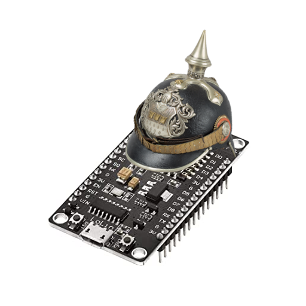

# otto266
[](https://github.com/jack23247/espresso-license)

Simulating IRAlab's Otto mobile platform's comms stack with an ESP8266 (NodeMCU 
"amica" 1.0)



## Goal

Providing dummy data to [rt-app](https://github.com/iralabdisco/rt-app)'s odometry module for testing.

## Howto

Download nanopb (I'm using 0.4.4) and unpack it in Arduino IDE's `libraries` folder. For example:

```
~/Arduino/libraries/nanopb-0.4.4
```

Is what I'm working with on Linux.

## Thanks To

[@fdila](https://github.com/fdila) - The mastermind behind Otto's comms stack, can't thank you enough!